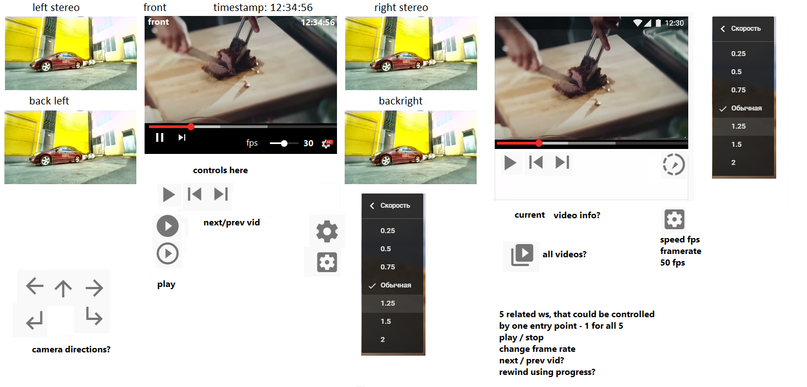

TODO:
---

do so:

- add ability to play different videos
- increase server stability (no shutdowns on page reload)
- something else....

- `change framerate` from 4 fps and so...
  
    - make framerate component (slider,dropdown? youtube-like?)
    - control framerate on client/player
    
- `construct most comfortable and ergonomic view in your opinion to an supervisor`

    - add play/pause controls
    - add playback nav component (youtube like)
    - readonly at first, it should display:
        - total videos length
        - preloaded length
        - current video played length
        - maybe video files/parts could be displayed also
    - playback nav
        - at first we could skip current file part and go next/prev (+/- 200 frames approx.)
        - then we can rewind totally to the start (replay video)
        - rewind to specific frame/pos on video progress component
    

use meta/timestamps or not? same video names?

- `Each line in .meta file is a timestamp of a corresponding frame in a video with the same base name.`

---
basic mockup:
---
